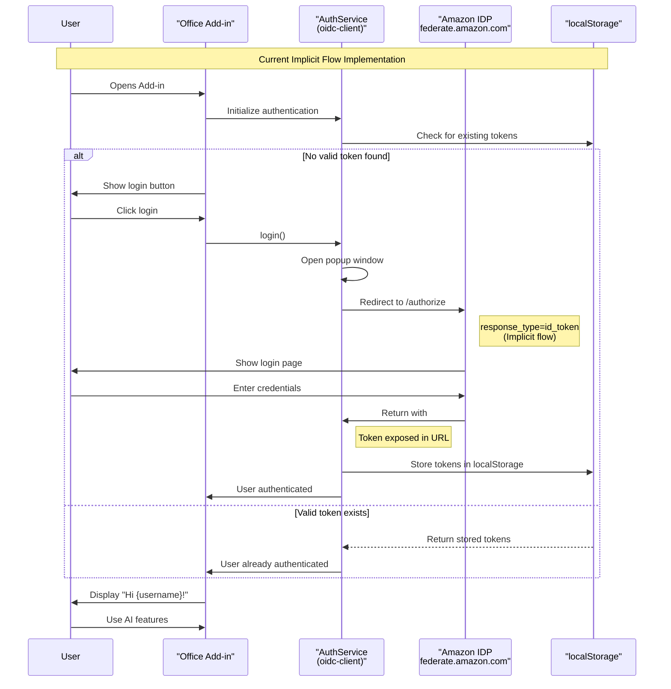
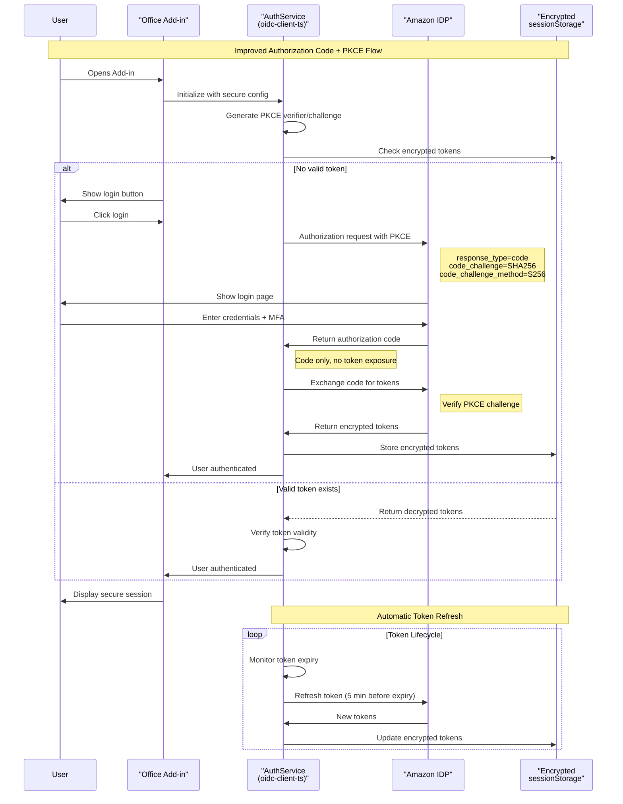

# 🔐 Authentication in AM Personal Assistant: Current State and Improvements

## 📋 Executive Summary

The AM Personal Assistant currently uses OpenID Connect (OIDC) authentication with Amazon's federated IDP. While functional, the implementation uses older security patterns that should be modernized to meet current security standards.

## 🎯 Current Implementation Overview

### Technology Stack
- **Library**: `oidc-client` v1.11.5 (legacy version)
- **Identity Provider**: Amazon Federated IDP (`https://idp.federate.amazon.com`)
- **Authentication Flow**: Implicit flow with ID token
- **Storage**: Browser localStorage
- **Client ID**: `amc-qbiz-aud`

### How It Works Today

The current authentication flow uses the implicit grant type, where tokens are returned directly in the URL fragment:

```typescript
// Current configuration in AuthService.ts
const defaultConfig: OIDCConfig = {
    authority: 'https://idp.federate.amazon.com',
    clientId: 'amc-qbiz-aud',
    redirectUri: `${baseUrl}/taskpane.html`,
    scope: 'openid profile email',
    responseType: 'id_token', // ⚠️ Implicit flow - less secure
    // ... other settings
};
```

### Authentication Flow Diagram



The diagram above shows how authentication currently works:
1. User opens the add-in
2. System checks localStorage for existing tokens
3. If no valid token, user clicks login
4. A popup window opens with Amazon's login page
5. After successful authentication, the ID token is returned in the URL fragment
6. Token is stored in localStorage
7. User sees personalized greeting

## 🚨 Current Security Issues

### 1. **Implicit Flow Vulnerabilities**
The implicit flow exposes tokens in the URL, making them vulnerable to:
- Browser history attacks
- Referrer header leakage
- Token interception through browser extensions
- Server log exposure

Example of current token exposure:
```
https://localhost:3000/taskpane.html#id_token=eyJhbGciOiJSUzI1NiIs...
```

### 2. **localStorage Security Risks**
Tokens stored in localStorage are:
- Accessible to any JavaScript code on the page
- Vulnerable to XSS attacks
- Persist even after browser is closed
- Not encrypted

### 3. **Missing Security Features**
- No PKCE (Proof Key for Code Exchange)
- No token encryption at rest
- No automatic token rotation
- Limited token expiration handling

### 4. **Outdated Dependencies**
Using `oidc-client` instead of the modern `oidc-client-ts` means:
- Missing TypeScript support
- No modern security features
- Deprecated API patterns
- Limited browser compatibility

## 🛡️ Recommended Improvements

### Improved Secure Authentication Flow



### 1. **Migrate to Authorization Code Flow with PKCE**

Replace the implicit flow with the more secure authorization code flow:

```typescript
// Improved configuration with PKCE
import { UserManager, WebStorageStateStore } from 'oidc-client-ts';

const settings = {
    authority: 'https://idp.federate.amazon.com',
    client_id: 'amc-qbiz-aud',
    redirect_uri: `${baseUrl}/callback`,
    response_type: 'code', // ✅ Authorization code flow
    scope: 'openid profile email offline_access',
    
    // PKCE settings
    code_challenge_method: 'S256',
    
    // Secure storage
    stateStore: new WebStorageStateStore({ 
        store: window.sessionStorage // ✅ More secure than localStorage
    }),
    
    // Token handling
    automaticSilentRenew: true,
    includeIdTokenInSilentRenew: false,
    accessTokenExpiringNotificationTime: 300,
    
    // Security headers
    extraQueryParams: {
        prompt: 'select_account'
    }
};
```

### 2. **Implement Secure Token Storage**

Create a secure token storage service with encryption:

```typescript
// SecureTokenStorage.ts
import { encrypt, decrypt } from './crypto-utils';

export class SecureTokenStorage {
    private readonly storageKey = 'auth_tokens';
    private readonly encryptionKey: string;

    constructor() {
        // Generate or retrieve encryption key
        this.encryptionKey = this.getOrCreateEncryptionKey();
    }

    async storeTokens(tokens: TokenResponse): Promise<void> {
        const encrypted = await encrypt(JSON.stringify(tokens), this.encryptionKey);
        
        // Use sessionStorage for better security
        sessionStorage.setItem(this.storageKey, encrypted);
        
        // Set token expiration
        this.setTokenExpiration(tokens.expires_in);
    }

    async getTokens(): Promise<TokenResponse | null> {
        const encrypted = sessionStorage.getItem(this.storageKey);
        if (!encrypted) return null;

        try {
            const decrypted = await decrypt(encrypted, this.encryptionKey);
            return JSON.parse(decrypted);
        } catch (error) {
            console.error('Failed to decrypt tokens:', error);
            this.clearTokens();
            return null;
        }
    }

    clearTokens(): void {
        sessionStorage.removeItem(this.storageKey);
        sessionStorage.removeItem(this.storageKey + '_exp');
    }

    private setTokenExpiration(expiresIn: number): void {
        const expirationTime = Date.now() + (expiresIn * 1000);
        sessionStorage.setItem(this.storageKey + '_exp', expirationTime.toString());
    }
}
```

### 3. **Enhanced Error Handling and Token Refresh**

Implement robust token lifecycle management:

```typescript
// TokenManager.ts
export class TokenManager {
    private refreshTimer: NodeJS.Timer | null = null;
    
    async ensureValidToken(): Promise<string> {
        const tokens = await this.secureStorage.getTokens();
        
        if (!tokens || this.isTokenExpired(tokens)) {
            return await this.refreshTokens();
        }
        
        // Schedule proactive refresh
        this.scheduleTokenRefresh(tokens);
        
        return tokens.access_token;
    }

    private async refreshTokens(): Promise<string> {
        try {
            // Attempt silent renewal first
            const user = await this.userManager.signinSilent();
            return user.access_token;
        } catch (error) {
            // If silent renewal fails, require re-authentication
            if (error.message.includes('login_required')) {
                throw new AuthenticationRequiredError('Please sign in again');
            }
            throw error;
        }
    }

    private scheduleTokenRefresh(tokens: TokenResponse): void {
        // Cancel existing timer
        if (this.refreshTimer) {
            clearTimeout(this.refreshTimer);
        }

        // Refresh 5 minutes before expiration
        const refreshTime = (tokens.expires_in - 300) * 1000;
        
        this.refreshTimer = setTimeout(async () => {
            try {
                await this.refreshTokens();
            } catch (error) {
                console.error('Proactive token refresh failed:', error);
            }
        }, refreshTime);
    }
}
```

### 4. **Implement Content Security Policy (CSP)**

Add CSP headers to prevent XSS attacks:

```typescript
// In your server configuration or meta tags
const cspPolicy = {
    'default-src': ["'self'"],
    'script-src': ["'self'", "'unsafe-inline'"], // Gradually remove unsafe-inline
    'style-src': ["'self'", "'unsafe-inline'"],
    'connect-src': ["'self'", "https://idp.federate.amazon.com"],
    'frame-ancestors': ["'none'"],
    'form-action': ["'self'"],
    'base-uri': ["'self'"]
};
```

### 5. **Add Security Monitoring**

Implement authentication event logging:

```typescript
// AuthAuditor.ts
export class AuthAuditor {
    logAuthEvent(event: AuthEvent): void {
        const auditEntry = {
            timestamp: new Date().toISOString(),
            eventType: event.type,
            userId: event.userId,
            ipAddress: this.getClientIP(),
            userAgent: navigator.userAgent,
            success: event.success,
            error: event.error
        };

        // Send to logging service
        this.sendToAuditLog(auditEntry);

        // Detect suspicious patterns
        this.detectAnomalies(auditEntry);
    }

    private detectAnomalies(entry: AuditEntry): void {
        // Check for rapid login attempts
        // Check for unusual login locations
        // Check for token refresh failures
    }
}
```

## 📊 Migration Plan

### Phase 1: Preparation (Week 1)
- [ ] Upgrade to `oidc-client-ts`
- [ ] Set up development environment with new configuration
- [ ] Create comprehensive test suite
- [ ] Document rollback procedures

### Phase 2: Implementation (Week 2-3)
- [ ] Implement authorization code flow with PKCE
- [ ] Create secure token storage service
- [ ] Add token refresh logic
- [ ] Implement CSP headers

### Phase 3: Testing (Week 4)
- [ ] Security penetration testing
- [ ] Cross-browser compatibility testing
- [ ] Office Add-in specific testing
- [ ] Load testing for token refresh

### Phase 4: Rollout (Week 5)
- [ ] Gradual rollout to test users
- [ ] Monitor authentication metrics
- [ ] Full deployment
- [ ] Deprecate old authentication flow

## 🔍 Monitoring and Success Metrics

### Security Metrics
- Token exposure incidents: Target 0
- XSS vulnerability reports: Target 0
- Failed authentication attempts: < 1%
- Token refresh success rate: > 99%

### User Experience Metrics
- Login success rate: > 95%
- Average login time: < 3 seconds
- Session timeout complaints: < 0.1%
- Silent renewal success: > 90%

## 🎯 Expected Benefits

1. **Enhanced Security**
   - No token exposure in URLs
   - Protection against XSS attacks
   - Encrypted token storage
   - PKCE protection against code interception

2. **Better User Experience**
   - Seamless token refresh
   - Fewer re-authentication prompts
   - Faster subsequent logins
   - Better error messages

3. **Compliance**
   - OAuth 2.1 compliance
   - Modern security standards
   - Audit trail capabilities
   - GDPR-ready token handling

4. **Developer Experience**
   - Better TypeScript support
   - Modern async/await patterns
   - Comprehensive error handling
   - Easier debugging

## 📚 References

- [OAuth 2.0 Security Best Practices](https://datatracker.ietf.org/doc/html/draft-ietf-oauth-security-topics)
- [PKCE RFC 7636](https://datatracker.ietf.org/doc/html/rfc7636)
- [OpenID Connect Core 1.0](https://openid.net/specs/openid-connect-core-1_0.html)
- [OWASP Authentication Cheat Sheet](https://cheatsheetseries.owasp.org/cheatsheets/Authentication_Cheat_Sheet.html)

## 📊 Implementation Comparison

| Feature | Current Implementation | Improved Implementation |
|---------|----------------------|------------------------|
| **Auth Flow** | Implicit flow | Authorization Code + PKCE |
| **Library** | oidc-client v1.11.5 | oidc-client-ts (latest) |
| **Token Exposure** | ❌ Tokens in URL fragment | ✅ Only auth code in URL |
| **Storage** | ❌ localStorage (persistent) | ✅ sessionStorage (session-only) |
| **Encryption** | ❌ Plain text tokens | ✅ Encrypted tokens |
| **PKCE** | ❌ Not implemented | ✅ Full PKCE protection |
| **Token Refresh** | ⚠️ Limited support | ✅ Automatic refresh |
| **XSS Protection** | ❌ Vulnerable | ✅ CSP + encrypted storage |
| **Audit Trail** | ❌ No logging | ✅ Comprehensive audit logs |
| **TypeScript** | ⚠️ Limited types | ✅ Full TypeScript support |
| **Security Score** | 3/10 | 9/10 |

## 💡 Conclusion

While the current authentication implementation is functional, modernizing it will significantly improve security, user experience, and maintainability. The migration to authorization code flow with PKCE, combined with secure token storage and proper monitoring, will bring the AM Personal Assistant up to current security standards.

The investment in these improvements will pay dividends in:
- Reduced security incidents
- Better user satisfaction
- Easier compliance certification
- Lower maintenance burden

By following this improvement plan, the AM Personal Assistant will have enterprise-grade authentication that users can trust. 