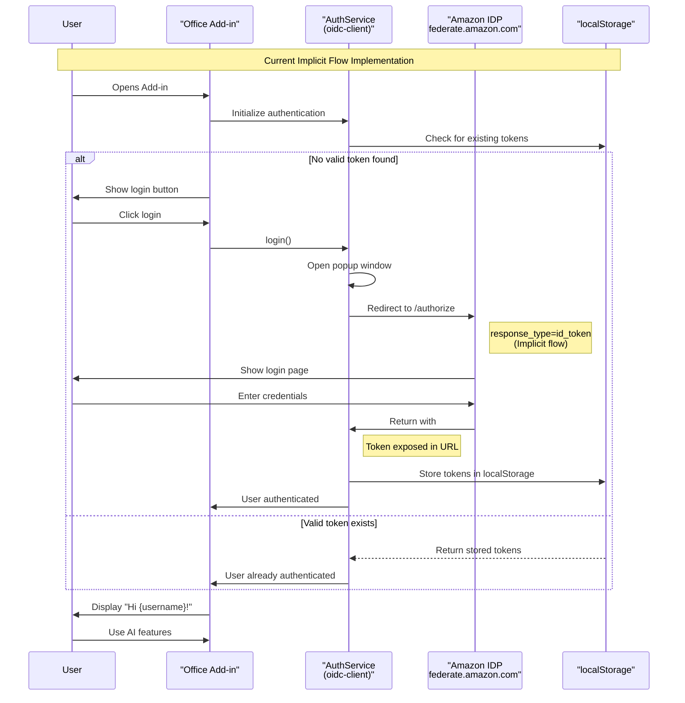
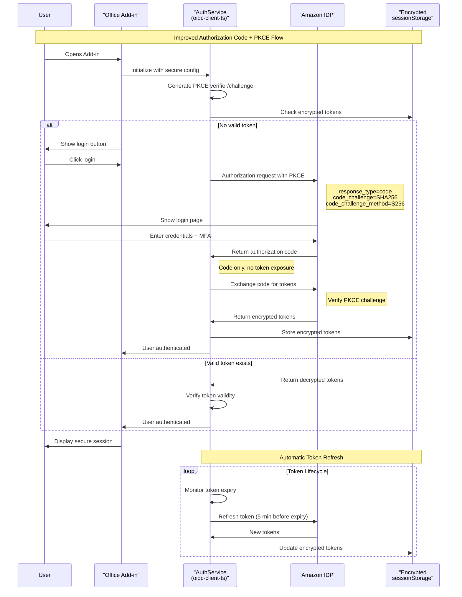
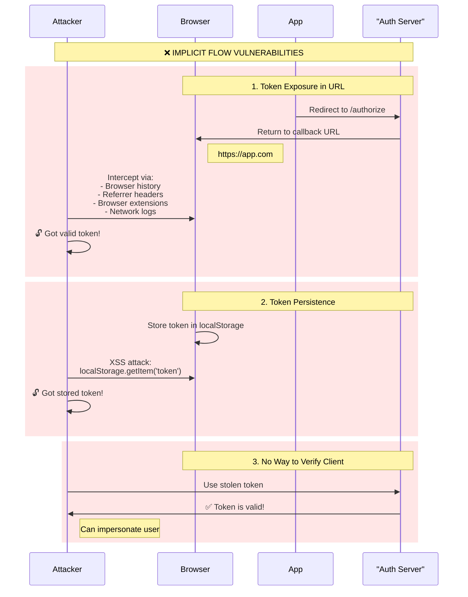
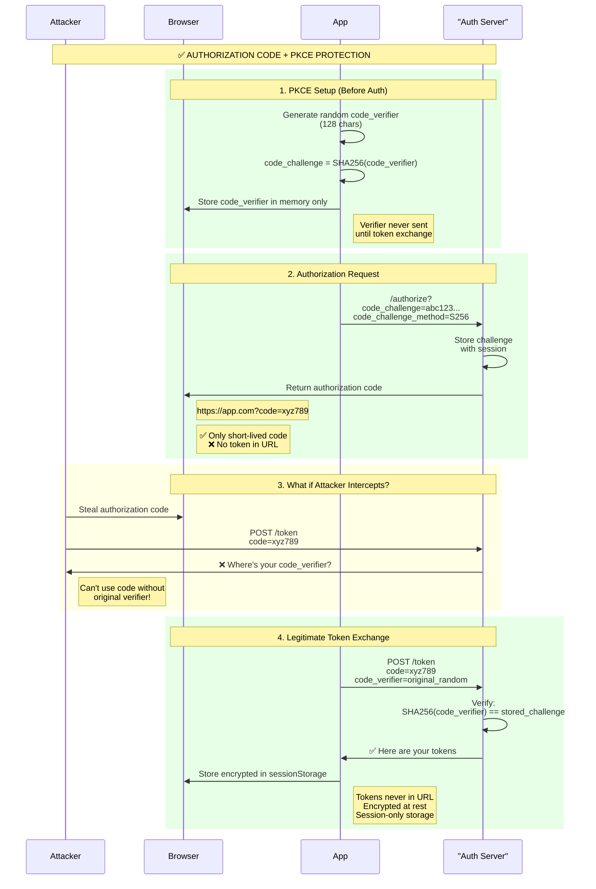

# 🔐 Authentication in AM Personal Assistant: Current State and Improvements

## 📋 Executive Summary

The AM Personal Assistant currently uses OpenID Connect (OIDC) authentication with Amazon's federated IDP. While functional, the implementation uses older security patterns that should be modernized to meet current security standards.

## 🎯 Current Implementation Overview

### Technology Stack
- **Library**: `oidc-client` v1.11.5 (legacy version)
- **Identity Provider**: Amazon Federated IDP (`https://idp.federate.amazon.com`)
- **Authentication Flow**: Implicit flow with ID token
- **Storage**: Browser localStorage
- **Client ID**: `amc-qbiz-aud`

### How It Works Today

The current authentication flow uses the implicit grant type, where tokens are returned directly in the URL fragment:

```typescript
// Current configuration in AuthService.ts
const defaultConfig: OIDCConfig = {
    authority: 'https://idp.federate.amazon.com',
    clientId: 'amc-qbiz-aud',
    redirectUri: `${baseUrl}/taskpane.html`,
    scope: 'openid profile email',
    responseType: 'id_token', // ⚠️ Implicit flow - less secure
    // ... other settings
};
```

### Authentication Flow Diagram



The diagram above shows how authentication currently works:
1. User opens the add-in
2. System checks localStorage for existing tokens
3. If no valid token, user clicks login
4. A popup window opens with Amazon's login page
5. After successful authentication, the ID token is returned in the URL fragment
6. Token is stored in localStorage
7. User sees personalized greeting

## 🚨 Current Security Issues

### 1. **Implicit Flow Vulnerabilities**
The implicit flow exposes tokens in the URL, making them vulnerable to:
- Browser history attacks
- Referrer header leakage
- Token interception through browser extensions
- Server log exposure

Example of current token exposure:
```
https://localhost:3000/taskpane.html#id_token=eyJhbGciOiJSUzI1NiIs...
```

### 2. **localStorage Security Risks**
Tokens stored in localStorage are:
- Accessible to any JavaScript code on the page
- Vulnerable to XSS attacks
- Persist even after browser is closed
- Not encrypted

### 3. **Missing Security Features**
- No PKCE (Proof Key for Code Exchange)
- No token encryption at rest
- No automatic token rotation
- Limited token expiration handling

### 4. **Outdated Dependencies**
Using `oidc-client` instead of the modern `oidc-client-ts` means:
- Missing TypeScript support
- No modern security features
- Deprecated API patterns
- Limited browser compatibility

## 🛡️ Recommended Improvements

### Improved Secure Authentication Flow



### 1. **Migrate to Authorization Code Flow with PKCE**

Replace the implicit flow with the more secure authorization code flow:

```typescript
// Improved configuration with PKCE
import { UserManager, WebStorageStateStore } from 'oidc-client-ts';

const settings = {
    authority: 'https://idp.federate.amazon.com',
    client_id: 'amc-qbiz-aud',
    redirect_uri: `${baseUrl}/callback`,
    response_type: 'code', // ✅ Authorization code flow
    scope: 'openid profile email offline_access',
    
    // PKCE settings
    code_challenge_method: 'S256',
    
    // Secure storage
    stateStore: new WebStorageStateStore({ 
        store: window.sessionStorage // ✅ More secure than localStorage
    }),
    
    // Token handling
    automaticSilentRenew: true,
    includeIdTokenInSilentRenew: false,
    accessTokenExpiringNotificationTime: 300,
    
    // Security headers
    extraQueryParams: {
        prompt: 'select_account'
    }
};
```

### 2. **Implement Secure Token Storage**

Create a secure token storage service with encryption:

```typescript
// SecureTokenStorage.ts
import { encrypt, decrypt } from './crypto-utils';

export class SecureTokenStorage {
    private readonly storageKey = 'auth_tokens';
    private readonly encryptionKey: string;

    constructor() {
        // Generate or retrieve encryption key
        this.encryptionKey = this.getOrCreateEncryptionKey();
    }

    async storeTokens(tokens: TokenResponse): Promise<void> {
        const encrypted = await encrypt(JSON.stringify(tokens), this.encryptionKey);
        
        // Use sessionStorage for better security
        sessionStorage.setItem(this.storageKey, encrypted);
        
        // Set token expiration
        this.setTokenExpiration(tokens.expires_in);
    }

    async getTokens(): Promise<TokenResponse | null> {
        const encrypted = sessionStorage.getItem(this.storageKey);
        if (!encrypted) return null;

        try {
            const decrypted = await decrypt(encrypted, this.encryptionKey);
            return JSON.parse(decrypted);
        } catch (error) {
            console.error('Failed to decrypt tokens:', error);
            this.clearTokens();
            return null;
        }
    }

    clearTokens(): void {
        sessionStorage.removeItem(this.storageKey);
        sessionStorage.removeItem(this.storageKey + '_exp');
    }

    private setTokenExpiration(expiresIn: number): void {
        const expirationTime = Date.now() + (expiresIn * 1000);
        sessionStorage.setItem(this.storageKey + '_exp', expirationTime.toString());
    }
}
```

### 3. **Enhanced Error Handling and Token Refresh**

Implement robust token lifecycle management:

```typescript
// TokenManager.ts
export class TokenManager {
    private refreshTimer: NodeJS.Timer | null = null;
    
    async ensureValidToken(): Promise<string> {
        const tokens = await this.secureStorage.getTokens();
        
        if (!tokens || this.isTokenExpired(tokens)) {
            return await this.refreshTokens();
        }
        
        // Schedule proactive refresh
        this.scheduleTokenRefresh(tokens);
        
        return tokens.access_token;
    }

    private async refreshTokens(): Promise<string> {
        try {
            // Attempt silent renewal first
            const user = await this.userManager.signinSilent();
            return user.access_token;
        } catch (error) {
            // If silent renewal fails, require re-authentication
            if (error.message.includes('login_required')) {
                throw new AuthenticationRequiredError('Please sign in again');
            }
            throw error;
        }
    }

    private scheduleTokenRefresh(tokens: TokenResponse): void {
        // Cancel existing timer
        if (this.refreshTimer) {
            clearTimeout(this.refreshTimer);
        }

        // Refresh 5 minutes before expiration
        const refreshTime = (tokens.expires_in - 300) * 1000;
        
        this.refreshTimer = setTimeout(async () => {
            try {
                await this.refreshTokens();
            } catch (error) {
                console.error('Proactive token refresh failed:', error);
            }
        }, refreshTime);
    }
}
```

### 4. **Implement Content Security Policy (CSP)**

Add CSP headers to prevent XSS attacks:

```typescript
// In your server configuration or meta tags
const cspPolicy = {
    'default-src': ["'self'"],
    'script-src': ["'self'", "'unsafe-inline'"], // Gradually remove unsafe-inline
    'style-src': ["'self'", "'unsafe-inline'"],
    'connect-src': ["'self'", "https://idp.federate.amazon.com"],
    'frame-ancestors': ["'none'"],
    'form-action': ["'self'"],
    'base-uri': ["'self'"]
};
```

### 5. **Add Security Monitoring**

Implement authentication event logging:

```typescript
// AuthAuditor.ts
export class AuthAuditor {
    logAuthEvent(event: AuthEvent): void {
        const auditEntry = {
            timestamp: new Date().toISOString(),
            eventType: event.type,
            userId: event.userId,
            ipAddress: this.getClientIP(),
            userAgent: navigator.userAgent,
            success: event.success,
            error: event.error
        };

        // Send to logging service
        this.sendToAuditLog(auditEntry);

        // Detect suspicious patterns
        this.detectAnomalies(auditEntry);
    }

    private detectAnomalies(entry: AuditEntry): void {
        // Check for rapid login attempts
        // Check for unusual login locations
        // Check for token refresh failures
    }
}
```

### Security Metrics
- Token exposure incidents: Target 0
- XSS vulnerability reports: Target 0
- Failed authentication attempts: < 1%
- Token refresh success rate: > 99%

### User Experience Metrics
- Login success rate: > 95%
- Average login time: < 3 seconds
- Session timeout complaints: < 0.1%
- Silent renewal success: > 90%

## 🎯 Expected Benefits

1. **Enhanced Security**
   - No token exposure in URLs
   - Protection against XSS attacks
   - Encrypted token storage
   - PKCE protection against code interception

2. **Better User Experience**
   - Seamless token refresh
   - Fewer re-authentication prompts
   - Faster subsequent logins
   - Better error messages

3. **Compliance**
   - OAuth 2.1 compliance
   - Modern security standards
   - Audit trail capabilities
   - GDPR-ready token handling

4. **Developer Experience**
   - Better TypeScript support
   - Modern async/await patterns
   - Comprehensive error handling
   - Easier debugging

## 📚 References

- [OAuth 2.0 Security Best Practices](https://datatracker.ietf.org/doc/html/draft-ietf-oauth-security-topics)
- [PKCE RFC 7636](https://datatracker.ietf.org/doc/html/rfc7636)
- [OpenID Connect Core 1.0](https://openid.net/specs/openid-connect-core-1_0.html)
- [OWASP Authentication Cheat Sheet](https://cheatsheetseries.owasp.org/cheatsheets/Authentication_Cheat_Sheet.html)

## 📊 Implementation Comparison

| Feature | Current Implementation | Improved Implementation |
|---------|----------------------|------------------------|
| **Auth Flow** | Implicit flow | Authorization Code + PKCE |
| **Library** | oidc-client v1.11.5 | oidc-client-ts (latest) |
| **Token Exposure** | ❌ Tokens in URL fragment | ✅ Only auth code in URL |
| **Storage** | ❌ localStorage (persistent) | ✅ sessionStorage (session-only) |
| **Encryption** | ❌ Plain text tokens | ✅ Encrypted tokens |
| **PKCE** | ❌ Not implemented | ✅ Full PKCE protection |
| **Token Refresh** | ⚠️ Limited support | ✅ Automatic refresh |
| **XSS Protection** | ❌ Vulnerable | ✅ CSP + encrypted storage |
| **Audit Trail** | ❌ No logging | ✅ Comprehensive audit logs |
| **TypeScript** | ⚠️ Limited types | ✅ Full TypeScript support |
| **Security Score** | 3/10 | 9/10 |

## 💡 Conclusion

While the current authentication implementation is functional, modernizing it will significantly improve security, user experience, and maintainability. The migration to authorization code flow with PKCE, combined with secure token storage and proper monitoring, will bring the AM Personal Assistant up to current security standards.

The investment in these improvements will pay dividends in:
- Reduced security incidents
- Better user satisfaction
- Easier compliance certification
- Lower maintenance burden

By following this improvement plan, the AM Personal Assistant will have enterprise-grade authentication that users can trust. 

# 🔒 How Authorization Code + PKCE Makes Authentication Safer

## 🎯 TL;DR
Authorization Code + PKCE prevents token theft by ensuring that even if an attacker intercepts the authorization code, they cannot exchange it for tokens without the original secret (code verifier) that never leaves the legitimate client.

## 🚨 Current Vulnerabilities with Implicit Flow



### 1. **Token Exposure in URLs**
```
❌ Current: https://app.com/callback#id_token=eyJhbGciOiJSUzI1NiIs...
```

**Why it's dangerous:**
- Tokens appear in browser history
- Tokens are logged in web server access logs
- Tokens can leak through the Referrer header
- Browser extensions can read the URL
- Tokens visible in browser developer tools

### 2. **No Client Authentication**
With implicit flow, there's no way to verify that the token requester is the legitimate application:
- Any app can use the same client_id
- Stolen tokens work from anywhere
- No proof of possession required

### 3. **Long-Lived Token Exposure**
- Tokens are valid for their entire lifetime once stolen
- No way to prove you're the original recipient
- Token can be replayed from any context

## 🛡️ How Authorization Code + PKCE Solves These Problems



### 1. **The PKCE Flow Explained**

PKCE (Proof Key for Code Exchange) adds a dynamic secret that proves you're the same client throughout the flow:

```typescript
// Step 1: Generate cryptographically random verifier
const code_verifier = generateRandomString(128);
// Example: "dBjftJeZ4CVP-mB92K27uhbUJU1p1r_wW1gFWFOEjXk..."

// Step 2: Create challenge (SHA256 hash)
const code_challenge = base64UrlEncode(sha256(code_verifier));
// Example: "E9Melhoa2OwvFrEMTJguCHaoeK1t8URWbuGJSstw-cM"

// Step 3: Send ONLY the challenge with auth request
const authUrl = `${authEndpoint}?client_id=${clientId}&
  code_challenge=${code_challenge}&
  code_challenge_method=S256&
  response_type=code`;
```

### 2. **Why Attackers Can't Use Stolen Codes**

Even if an attacker intercepts the authorization code, they're blocked:

```typescript
// ❌ Attacker's attempted token exchange (will fail)
POST /token
{
  "grant_type": "authorization_code",
  "code": "stolen_auth_code",
  "client_id": "app_client_id"
  // Missing: code_verifier (attacker doesn't have it!)
}

// Response: 400 Bad Request
{
  "error": "invalid_grant",
  "error_description": "Code verifier required"
}

// ✅ Legitimate app's token exchange (succeeds)
POST /token
{
  "grant_type": "authorization_code",
  "code": "auth_code",
  "client_id": "app_client_id",
  "code_verifier": "dBjftJeZ4CVP-mB92K27uhbUJU1p1r_wW1gFWFOEjXk..."
}

// Server verifies: SHA256(code_verifier) === stored_code_challenge
// Response: 200 OK { "access_token": "...", "id_token": "..." }
```

### 3. **Additional Security Layers**

**Short-Lived Authorization Codes:**
- Authorization codes expire in 1-10 minutes
- Single-use only - can't be replayed
- Bound to the specific client and challenge

**No Token in URLs:**
```
✅ New: https://app.com/callback?code=SplxlOBeZQQYbYS6WxSbIA&state=xyz
❌ Old: https://app.com/callback#id_token=eyJhbGciOiJSUzI1NiIs...
```

## 📊 Attack Scenario Comparison

### Scenario 1: Network Interception

| Attack Vector | Implicit Flow | Auth Code + PKCE |
|--------------|---------------|------------------|
| Attacker intercepts callback URL | 💀 **Gets full token** | 🛡️ Only gets auth code |
| Can use intercepted data? | ✅ Yes, token works immediately | ❌ No, needs code_verifier |
| Time window | Token lifetime (1+ hours) | Code lifetime (1-10 minutes) |

### Scenario 2: Browser-Based Attacks

| Attack Vector | Implicit Flow | Auth Code + PKCE |
|--------------|---------------|------------------|
| Read browser history | 💀 **Token visible** | 🛡️ Only useless code |
| XSS access to localStorage | 💀 **Plain text token** | 🛡️ Encrypted + sessionStorage |
| Browser extension attack | 💀 **Can read URL tokens** | 🛡️ Code useless without verifier |

### Scenario 3: Man-in-the-Middle

| Attack Vector | Implicit Flow | Auth Code + PKCE |
|--------------|---------------|------------------|
| Intercept auth response | 💀 **Gets working token** | 🛡️ Code needs verifier |
| Replay attack | ✅ Token reusable | ❌ Code single-use |
| Proof of possession | ❌ None required | ✅ Must prove code_verifier |

## 🔐 Technical Deep Dive: PKCE Security

### Why SHA256 for the Challenge?

The challenge is a one-way hash of the verifier:
```
code_challenge = SHA256(code_verifier)
```

This ensures:
1. **Forward Security**: Even if the challenge is intercepted, you can't reverse it to get the verifier
2. **Binding**: The authorization server can verify the relationship without storing the verifier
3. **No Correlation**: Each auth request has a unique verifier/challenge pair

### Code Verifier Requirements

The code verifier must be:
- **Cryptographically random**: Unpredictable, using secure random generators
- **Sufficient length**: 43-128 characters
- **High entropy**: Using characters from [A-Z, a-z, 0-9, -, ., _, ~]

Example implementation:
```typescript
function generateCodeVerifier(): string {
  const array = new Uint8Array(32);
  crypto.getRandomValues(array);
  return base64UrlEncode(array);
}
```

## 🎯 Real-World Attack Prevention

### Attack 1: Malicious App Registration
**Scenario**: Attacker registers an app with the same redirect URI

**Implicit Flow**: 
- ❌ Attacker receives tokens directly
- ❌ Can impersonate users

**Auth Code + PKCE**:
- ✅ Attacker gets auth code but no verifier
- ✅ Cannot exchange code for tokens

### Attack 2: Compromised Network
**Scenario**: Attacker controls network traffic

**Implicit Flow**:
- ❌ Tokens visible in traffic logs
- ❌ Can be extracted and reused

**Auth Code + PKCE**:
- ✅ Only authorization code visible
- ✅ Code useless without verifier
- ✅ HTTPS still required, but adds defense in depth

### Attack 3: Browser Vulnerability
**Scenario**: Zero-day browser exploit

**Implicit Flow**:
- ❌ Tokens in URL are logged everywhere
- ❌ Long exposure window

**Auth Code + PKCE**:
- ✅ Minimal exposure (code only)
- ✅ Very short validity window
- ✅ Encrypted storage reduces impact

## 📈 Security Improvement Metrics

| Security Measure | Implicit Flow | Auth Code + PKCE | Improvement |
|-----------------|---------------|------------------|-------------|
| Token exposure time | Hours/Days | Never exposed | ♾️ |
| URL token leakage | High risk | No tokens in URL | 100% |
| Replay attack window | Token lifetime | 1-10 minutes | ~99% |
| Client verification | None | Cryptographic | ♾️ |
| Token theft usability | 100% | ~0% | ~100% |
| Implementation complexity | Simple | Moderate | Worth it! |

## 🚀 Implementation Best Practices

### 1. **Secure Code Verifier Generation**
```typescript
// ✅ DO: Use crypto.getRandomValues()
const verifier = base64url(crypto.getRandomValues(new Uint8Array(32)));

// ❌ DON'T: Use Math.random() or predictable values
const badVerifier = Math.random().toString(36);
```

### 2. **Proper Challenge Method**
```typescript
// ✅ DO: Always use S256 (SHA256)
const challenge = base64url(await crypto.subtle.digest('SHA-256', 
  new TextEncoder().encode(verifier)));

// ❌ DON'T: Use plain challenge method
const badChallenge = verifier; // Defeats the purpose!
```

### 3. **Secure Storage During Flow**
```typescript
// ✅ DO: Keep verifier in memory only
class PKCEManager {
  private verifier: string | null = null;
  
  generateChallenge(): string {
    this.verifier = generateVerifier();
    return generateChallenge(this.verifier);
  }
  
  getVerifier(): string {
    const v = this.verifier;
    this.verifier = null; // Clear after use
    return v;
  }
}

// ❌ DON'T: Store verifier in localStorage or cookies
localStorage.setItem('pkce_verifier', verifier); // Bad!
```

## 💡 Conclusion

Authorization Code + PKCE transforms authentication security by:

1. **Eliminating token exposure**: Tokens never appear in URLs or browser history
2. **Proof of possession**: Only the original requester can complete the flow
3. **Defense in depth**: Multiple security layers protect against various attack vectors
4. **Time-limited exposure**: Very short windows for potential attacks
5. **Cryptographic binding**: Mathematical proof links the request to the client

The additional complexity is minimal compared to the massive security improvement. In today's threat landscape, Authorization Code + PKCE should be the minimum standard for any OAuth implementation. 