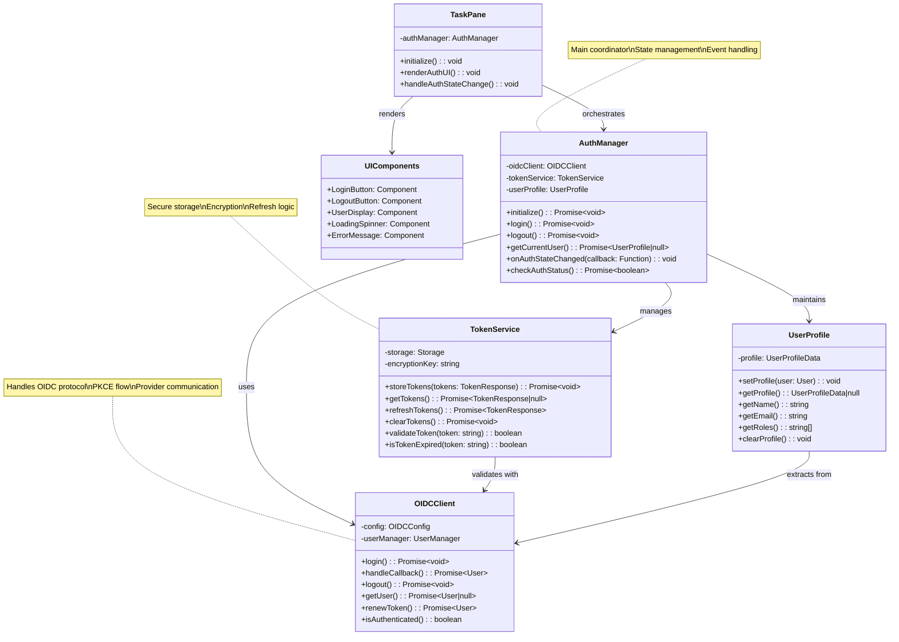

# 🔐 OIDC Authentication Design Document

## 📋 Overview
Add OpenID Connect authentication to the Seller Email Assistant using a custom OIDC client to identify users, enable personalization, and secure AI features.

## 🎯 Goals
- **User Identity**: Authenticate and identify users accessing the add-in
- **Security**: Secure access to AI summarization features  
- **Personalization**: Enable user-specific experiences
- **Provider Flexibility**: Support multiple OIDC providers (Azure AD, Auth0, Keycloak, etc.)

## 🏗️ Architecture

### High-Level Flow
```
User → Add-in → Custom OIDC Client → Provider → Token → User Profile → AI Features
```

### Component Design
```
├── OIDCClient (Custom OIDC implementation)
├── AuthManager (Main orchestrator)
├── TokenService (Token storage & refresh)
├── UserProfile (User data management)
└── UI Components (Login/Logout buttons)
```

### UML Class Diagram


## 🔧 Implementation Approach

### Custom OIDC Client (Selected)
- **Provider Agnostic**: Works with any OIDC-compliant provider
- **Flexible Configuration**: Support multiple auth providers
- **Full Control**: Custom token handling and security policies
- **Standards Compliant**: Follows OpenID Connect specification

### OIDC Client Configuration
```typescript
interface OIDCConfig {
  authority: string;           // https://auth.provider.com
  clientId: string;           // seller-email-assistant
  redirectUri: string;        // https://localhost:3000/callback
  scope: string;              // "openid profile email"
  responseType: string;       // "code"
  additionalParams?: Record<string, string>;
}
```

### Option 2: Amazon-Style Service Pattern
Based on Amazon's internal implementation, using service abstraction with implicit flow:

```typescript
// Similar to Amazon's AuthService implementation
export class AuthService {
  private userManager: UserManager;

  constructor() {
    const settings: UserManagerSettings = {
      authority: 'https://your-auth-provider.com',
      client_id: 'seller-email-assistant',
      redirect_uri: 'https://localhost:3000/callback',
      response_type: 'id_token', // Implicit flow
      scope: 'openid profile email',
      stateStore: new WebStorageStateStore({ store: window.localStorage }),
      automaticSilentRenew: true,
      includeIdTokenInSilentRenew: true,
      monitorSession: true,
      filterProtocolClaims: true,
    };
    this.userManager = new UserManager(settings);
  }

  public login = async (): Promise<void> => {
    await this.userManager.signinRedirect();
  };

  public handleCallback = async (): Promise<void> => {
    const user = await this.userManager.signinRedirectCallback();
    console.log('User:', user);
  };

  public getUser = async (): Promise<User | null> => {
    return await this.userManager.getUser();
  };
}

// Singleton instance
export const authService = new AuthService();
```

**Pros:**
- ✅ **Simple Setup**: Quick to implement with minimal configuration
- ✅ **Service Pattern**: Clean abstraction with singleton pattern
- ✅ **Automatic Renewal**: Built-in token refresh capabilities
- ✅ **Session Monitoring**: Automatic session state management

**Cons:**
- ⚠️ **Security**: Uses implicit flow instead of more secure authorization code + PKCE
- ⚠️ **Storage**: Uses localStorage which is less secure than sessionStorage
- ⚠️ **Library Version**: Uses older `oidc-client` instead of modern `oidc-client-ts`
- ⚠️ **Token Exposure**: ID tokens exposed in URL fragments (implicit flow)

## 🔄 Authentication Flow

1. **Initialize**: Configure OIDC client with provider settings
2. **Check Auth State**: On add-in load, check for existing token
3. **Login Redirect**: If not authenticated, redirect to authorization endpoint
4. **Authorization Code**: Provider returns code after user authentication
5. **Token Exchange**: Exchange authorization code for access/ID tokens
6. **Store Tokens**: Securely store tokens with expiration handling
7. **Extract Profile**: Parse ID token claims for user information
8. **Enable Features**: Show authenticated UI and AI functionality

## 💾 Data Management

### OIDC Token Response
```typescript
interface TokenResponse {
  access_token: string;
  id_token: string;
  refresh_token?: string;
  token_type: string;
  expires_in: number;
  scope: string;
}
```

### User Profile (from ID Token)
```typescript
interface UserProfile {
  sub: string;                // Subject identifier
  name: string;               // Full name
  email: string;              // Email address
  email_verified: boolean;    // Email verification status
  org?: string;               // Organization claim
  roles?: string[];           // User roles
  iat: number;                // Issued at
  exp: number;                // Expiration time
}
```

## 🎨 UI Changes

### Before Auth
```