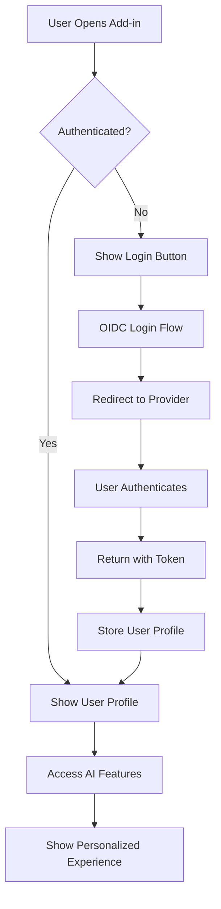

# 🔐 Implement OIDC Authentication for User Identity

## 📋 **Issue Summary**
Add OpenID Connect (OIDC) authentication to the AM Personal Assistant to retrieve and manage user identity information. This will enable user-specific features, personalization, and usage tracking.

## 🎯 **Goal & Business Requirements**
- **User Identification**: Identify which user is accessing the add-in
- **Personalization**: Customize the experience based on user profile
- **Security**: Secure access to AI summarization features
- **Analytics**: Track usage patterns per user
- **Compliance**: Meet enterprise authentication standards

## 🔧 **Technical Requirements**

### **Core Functionality**
- [ ] Implement OIDC authentication flow
- [ ] Retrieve user identity claims (name, email, organization)
- [ ] Store user session securely
- [ ] Handle token refresh automatically
- [ ] Implement logout functionality

### **Integration Points**
- [ ] Office.js authentication APIs
- [ ] Azure AD / Microsoft 365 integration
- [ ] Custom OIDC provider support
- [ ] Token storage in browser (secure)

## 🏗️ **Implementation Approach**

### **Option 1: Microsoft Graph Authentication**
```typescript
// Use Office.js built-in authentication
Office.auth.getAccessToken({
  allowSignInPrompt: true,
  allowConsentPrompt: true,
  forMSGraphAccess: true
})
```

### **Option 2: Custom OIDC Provider**
```typescript
// Generic OIDC implementation
const oidcConfig = {
  authority: 'https://your-oidc-provider.com',
  client_id: 'am-personal-assistant',
  redirect_uri: 'https://localhost:3000/callback',
  scope: 'openid profile email'
};
```

### **Option 3: Azure AD B2C**
```typescript
// Azure AD B2C for external users
const msalConfig = {
  auth: {
    clientId: 'your-client-id',
    authority: 'https://your-tenant.b2clogin.com/your-tenant.onmicrosoft.com/B2C_1_signin',
    knownAuthorities: ['your-tenant.b2clogin.com']
  }
};
```

## 📁 **Files to Modify**

### **New Files**
- `src/auth/oidcAuth.ts` - Main authentication logic
- `src/auth/tokenManager.ts` - Token storage and refresh
- `src/auth/userProfile.ts` - User profile management
- `src/types/auth.ts` - Authentication type definitions

### **Existing Files**
- `src/taskpane/taskpane.ts` - Add auth initialization
- `src/taskpane/taskpane.html` - Add login/logout UI
- `manifest.json` - Add authentication permissions
- `package.json` - Add OIDC libraries

## 🎨 **UI/UX Changes**

### **Login State**
```html
<div class="auth-section">
  <button id="login-btn" class="ms-Button ms-Button--primary">
    🔐 Sign In to Continue
  </button>
</div>
```

### **Authenticated State**
```html
<div class="user-info">
  <span class="user-avatar">👤</span>
  <span class="user-name">John Doe</span>
  <button id="logout-btn" class="ms-Button ms-Button--default">
    Sign Out
  </button>
</div>
```

## 📦 **Dependencies to Add**

```json
{
  "dependencies": {
    "@azure/msal-node": "^2.0.0",
    "oidc-client-ts": "^3.0.0",
    "jwt-decode": "^4.0.0"
  },
  "devDependencies": {
    "@types/jwt-decode": "^3.1.0"
  }
}
```

## 🔒 **Security Considerations**

### **Token Storage**
- Use secure browser storage (not localStorage)
- Implement token encryption
- Set appropriate token expiry times
- Clear tokens on logout

### **HTTPS Requirements**
- Ensure all authentication flows use HTTPS
- Validate SSL certificates
- Implement CSRF protection

### **Privacy**
- Only request necessary user claims
- Implement data retention policies
- Provide clear privacy notice

## 🧪 **Testing Strategy**

### **Unit Tests**
- [ ] Authentication flow tests
- [ ] Token management tests
- [ ] User profile parsing tests
- [ ] Error handling tests

### **Integration Tests**
- [ ] Office.js integration
- [ ] OIDC provider connectivity
- [ ] Token refresh scenarios
- [ ] Logout functionality

### **E2E Tests**
- [ ] Complete login flow
- [ ] Authenticated user experience
- [ ] Session timeout handling
- [ ] Multi-user scenarios

## 📊 **User Experience Flow**



## ✅ **Acceptance Criteria**

### **Must Have**
- [ ] User can sign in using OIDC
- [ ] User profile is displayed in UI
- [ ] Authentication tokens are managed securely
- [ ] User can sign out
- [ ] Works in both Office and browser modes

### **Should Have**
- [ ] Remember user login state
- [ ] Automatic token refresh
- [ ] Error handling for auth failures
- [ ] Loading states during authentication

### **Nice to Have**
- [ ] Multiple OIDC provider support
- [ ] User preference storage
- [ ] Admin panel for user management
- [ ] Usage analytics per user

## 🚀 **Implementation Timeline**

### **Phase 1: Core Authentication (Week 1)**
- Set up OIDC client library
- Implement basic login/logout
- Add user profile display

### **Phase 2: Token Management (Week 2)**
- Secure token storage
- Automatic refresh logic
- Session management

### **Phase 3: Integration & Testing (Week 3)**
- Office.js integration
- Comprehensive testing
- Error handling refinement

### **Phase 4: UI Polish & Documentation (Week 4)**
- UI/UX improvements
- Documentation updates
- Performance optimization

## 🔗 **References**
- [Office Add-ins Authentication](https://docs.microsoft.com/en-us/office/dev/add-ins/develop/auth-overview)
- [OpenID Connect Specification](https://openid.net/connect/)
- [Microsoft Graph Authentication](https://docs.microsoft.com/en-us/graph/auth/)
- [MSAL.js Documentation](https://docs.microsoft.com/en-us/azure/active-directory/develop/msal-overview)

## 💬 **Discussion Points**
- Which OIDC provider should we prioritize? (Azure AD, Auth0, Custom)
- Should we support multiple authentication methods?
- How should we handle offline scenarios?
- What user claims are essential for the MVP?

---

**Labels**: `enhancement`, `authentication`, `security`, `user-experience`
**Assignee**: TBD
**Priority**: High
**Milestone**: v2.0.0 