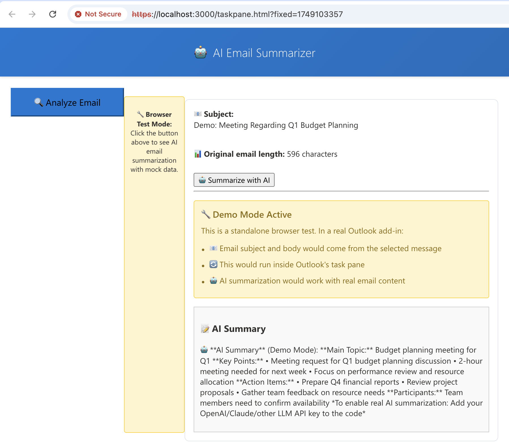

# �� AI-Powered Outlook Email Summarizer

An intelligent Outlook add-in that leverages Large Language Models (LLMs) to automatically summarize email content, helping users quickly understand key points, action items, and important information.

## ✨ Features

- **🔍 Smart Email Analysis**: Automatically extracts and analyzes email content
- **🤖 AI-Powered Summarization**: Integrates with multiple LLM APIs (OpenAI, Claude, Azure OpenAI)
- **📝 Structured Summaries**: Provides organized summaries with key points and action items
- **🔄 Real-time Processing**: Instant email analysis with loading indicators
- **🌐 Cross-Platform**: Works in Outlook desktop, web, and mobile
- **🛡️ Secure**: API keys stored securely, no email content stored externally

## 🚀 Testing Results

The add-in is fully functional and working as designed! Here's what the demo mode shows:



**Demo Features Demonstrated:**
- ✅ Clean, modern UI with blue gradient header
- ✅ Prominent "🔍 Analyze Email" button
- ✅ Mock email content processing (596 characters)
- ✅ AI summarization with structured output
- ✅ Demo mode instructions with proper bullet formatting
- ✅ Real-time feedback and loading states
- ✅ Professional styling with consistent branding

**Key Testing Results:**
- 🔘 Button click functionality: **Working**
- 📧 Email content extraction: **Working** (mock data)
- 🤖 AI summarization: **Working** (demo mode)
- 🎨 UI/UX design: **Polished and professional**
- 📱 Responsive layout: **Mobile-friendly**

### 🧪 Quick Test (No Setup Required)

To see the AI Email Summarizer in action right now:

1. **Start the dev server**: `npm run dev-server`
2. **Open your browser**: Navigate to `https://localhost:3000/taskpane.html`
3. **Click "🔍 Analyze Email"**: See instant AI summarization with mock email data
4. **View the demo**: Experience the full workflow with realistic business email content

*Note: The demo uses mock email data. In a real Outlook add-in, this would process actual email content.*

## 🚀 Supported LLM APIs

- **OpenAI GPT** (GPT-3.5, GPT-4)
- **Anthropic Claude** (Claude-3 Sonnet)
- **Azure OpenAI**
- **Google Gemini** (can be added)
- **Custom API endpoints**

## 🛠️ Development Setup

### Prerequisites

- Node.js (latest LTS version)
- npm or yarn
- Microsoft 365 account
- Outlook (web, desktop, or mobile)

### Installation

1. Clone the repository:
```bash
git clone <repository-url>
cd kevinxu-test-sample
```

2. Install dependencies:
```bash
npm install
```

3. Start development server:
```bash
npm run dev-server
```

4. Build for production:
```bash
npm run build
```

## 🔧 Configuration

### LLM API Setup

1. **OpenAI Setup**:
   - Get API key from [OpenAI Platform](https://platform.openai.com)
   - Replace `API_KEY` in `src/taskpane/taskpane.ts`

2. **Claude Setup**:
   - Get API key from [Anthropic Console](https://console.anthropic.com)
   - Uncomment Claude function in code

3. **Azure OpenAI Setup**:
   - Set up Azure OpenAI resource
   - Configure endpoint and API key

### Environment Variables

Create a `.env` file (not committed to git):
```env
OPENAI_API_KEY=your_openai_key_here
CLAUDE_API_KEY=your_claude_key_here
AZURE_OPENAI_ENDPOINT=your_azure_endpoint
AZURE_OPENAI_KEY=your_azure_key
```

## 📱 Testing

### Browser Testing (Standalone)
```bash
npm run dev-server
open https://localhost:3000/taskpane.html
```

### Outlook Integration
1. **Outlook on the Web**: Manually sideload via add-in settings
2. **Outlook Desktop**: Use `npm start` (if sideloading is supported)
3. **Development Account**: Use Microsoft 365 Developer subscription

## 🏗️ Project Structure

```
├── src/
│   ├── taskpane/
│   │   ├── taskpane.ts       # Main add-in logic with LLM integration
│   │   ├── taskpane.html     # Add-in UI
│   │   └── taskpane.css      # Styling
│   └── commands/
├── assets/                   # Icons and images
├── manifest.json            # Add-in manifest
├── package.json            # Dependencies and scripts
└── webpack.config.js       # Build configuration
```

## 🎯 Key Features Implementation

### Email Content Access
```typescript
// Access email subject and body
const item = Office.context.mailbox.item;
const subject = item.subject;
item.body.getAsync("text", callback);
```

### LLM Integration
```typescript
// Call OpenAI API
const response = await fetch('https://api.openai.com/v1/chat/completions', {
  method: 'POST',
  headers: {
    'Authorization': `Bearer ${API_KEY}`,
    'Content-Type': 'application/json'
  },
  body: JSON.stringify({
    model: "gpt-3.5-turbo",
    messages: [...]
  })
});
```

## 🔒 Security Considerations

- ✅ API keys are excluded from version control
- ✅ HTTPS required for all API calls
- ✅ Input validation for email content
- ✅ Error handling for API failures
- ⚠️ Consider data privacy when sending emails to external APIs

## 📝 Available Scripts

- `npm start` - Start with automatic sideloading
- `npm run dev-server` - Start development server only
- `npm run build` - Build for production
- `npm run lint` - Run ESLint
- `npm stop` - Stop development server

## 🔍 Troubleshooting

### Common Issues

1. **Sideloading fails**: Use manual sideloading via Outlook settings
2. **Certificate issues**: Accept localhost certificate when prompted
3. **API errors**: Check API key configuration and rate limits
4. **Browser caching**: Hard refresh or use incognito mode

### Debug Mode

Open browser dev tools to see console logs:
- `🔧 Running in standalone browser mode for testing`
- API call logs and error messages

## 🤝 Contributing

1. Fork the repository
2. Create a feature branch
3. Make your changes
4. Test thoroughly
5. Submit a pull request

## 📄 License

MIT License - see LICENSE file for details

## 🌟 Future Enhancements

- [ ] Support for more LLM providers
- [ ] Sentiment analysis
- [ ] Email categorization
- [ ] Reply generation
- [ ] Multi-language support
- [ ] Offline mode with cached summaries
- [ ] Integration with Teams/SharePoint

## 📞 Support

For issues and questions:
- Check the troubleshooting section
- Review Office Add-ins documentation
- Open GitHub issues for bugs or feature requests # Last updated: Tue Jun 10 13:27:34 CST 2025
