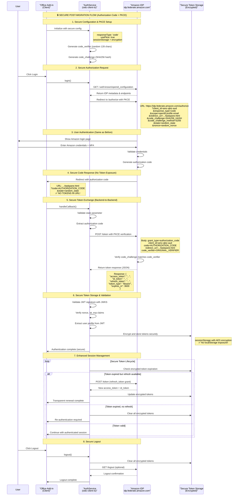

---

## 🔒 **POST-MIGRATION: Secure Authentication Flow**

### **Enhanced Security Architecture (After Migration)**

The following diagram shows how the authentication flow will work **AFTER** implementing the Authorization Code + PKCE migration:



### **🔒 Key Security Improvements in New Flow**

#### **1. PKCE Protection**
```typescript
// Code verifier generation (cryptographically secure random)
const codeVerifier = generateRandomString(128); // Base64URL-encoded

// Code challenge generation (SHA256 hash)
const codeChallenge = base64URLEncode(sha256(codeVerifier));

// Authorization request includes challenge
const authUrl = `${authority}/authorize?` +
    `code_challenge=${codeChallenge}&` +
    `code_challenge_method=S256&` +
    // ... other parameters
```

#### **2. No Token Exposure**
- ✅ **Before**: `#id_token=eyJ...` (exposed in URL)
- ✅ **After**: `?code=AUTH_CODE` (short-lived, single-use code)

#### **3. Secure Token Exchange**
```typescript
// Backend-to-backend token exchange (no client secret needed)
const tokenResponse = await fetch(`${authority}/token`, {
    method: 'POST',
    headers: { 'Content-Type': 'application/x-www-form-urlencoded' },
    body: new URLSearchParams({
        grant_type: 'authorization_code',
        client_id: clientId,
        code: authorizationCode,
        redirect_uri: redirectUri,
        code_verifier: codeVerifier // PKCE verification
    })
});
```

#### **4. Encrypted Token Storage**
```typescript
// Secure token storage implementation
class SecureTokenService {
    private readonly ENCRYPTION_KEY = 'derived-from-secure-source';
    
    async storeTokens(tokens: TokenResponse): Promise<void> {
        const encrypted = CryptoJS.AES.encrypt(
            JSON.stringify(tokens), 
            this.ENCRYPTION_KEY
        ).toString();
        
        // Use sessionStorage instead of localStorage
        sessionStorage.setItem('encrypted_auth_tokens', encrypted);
    }
    
    async getTokens(): Promise<TokenResponse | null> {
        const encrypted = sessionStorage.getItem('encrypted_auth_tokens');
        if (!encrypted) return null;
        
        const decrypted = CryptoJS.AES.decrypt(encrypted, this.ENCRYPTION_KEY);
        return JSON.parse(decrypted.toString(CryptoJS.enc.Utf8));
    }
}
```

#### **5. Enhanced Token Refresh**
```typescript
// Automatic token refresh with refresh_token
async refreshTokens(): Promise<void> {
    const currentTokens = await this.tokenService.getTokens();
    if (!currentTokens?.refresh_token) {
        throw new Error('No refresh token available');
    }
    
    const refreshResponse = await fetch(`${authority}/token`, {
        method: 'POST',
        headers: { 'Content-Type': 'application/x-www-form-urlencoded' },
        body: new URLSearchParams({
            grant_type: 'refresh_token',
            client_id: clientId,
            refresh_token: currentTokens.refresh_token
        })
    });
    
    const newTokens = await refreshResponse.json();
    await this.tokenService.storeTokens(newTokens);
}
```

### **🛡️ Security Benefits Summary**

| Security Aspect | Before (Implicit) | After (Code + PKCE) |
|------------------|-------------------|---------------------|
| **Token Exposure** | ❌ Tokens in URL hash | ✅ No token exposure |
| **CSRF Protection** | ⚠️ Basic state param | ✅ PKCE + state validation |
| **Token Storage** | ❌ Plain localStorage | ✅ Encrypted sessionStorage |
| **Token Refresh** | ❌ No refresh tokens | ✅ Secure refresh mechanism |
| **Replay Attacks** | ⚠️ Limited protection | ✅ Single-use codes + PKCE |
| **XSS Resistance** | ❌ Vulnerable | ✅ Encrypted storage |
| **Browser History** | ❌ Tokens logged | ✅ Clean URLs |
| **Network Logs** | ❌ Token visibility | ✅ Code-only visibility |

### **📋 Migration Validation Checklist**

- [ ] ✅ Authorization code received instead of tokens
- [ ] ✅ PKCE code_challenge/code_verifier flow working
- [ ] ✅ Token exchange via POST request (not URL)
- [ ] ✅ Encrypted token storage implemented
- [ ] ✅ Refresh token mechanism functional
- [ ] ✅ No tokens visible in browser developer tools
- [ ] ✅ No tokens in browser history
- [ ] ✅ Silent token renewal working
- [ ] ✅ Office Add-in compatibility maintained
- [ ] ✅ Amazon IDP integration successful

--- 